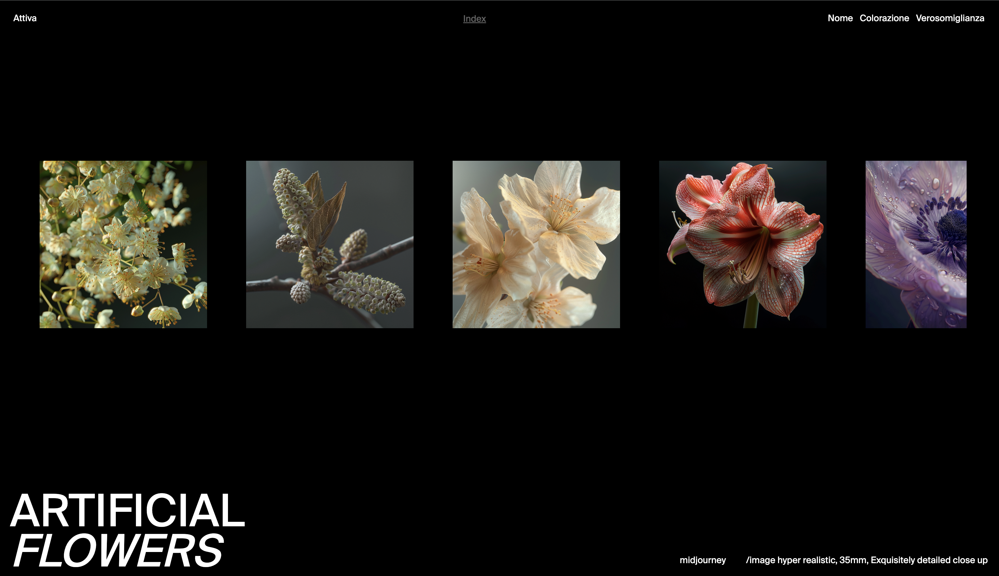
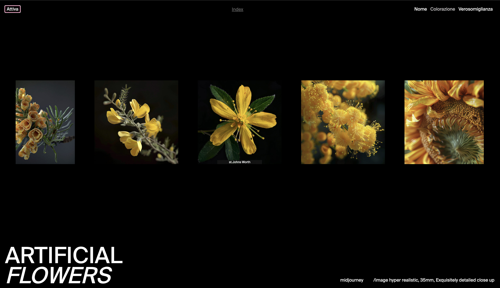

SUPSI 2023-24  
Corso d’interaction design, CV428.01  
Docenti: A. Gysin, G. Profeta  

Elaborato 1: Archivio Digitale XS

# Artificial *Flowers*
Autore: Arianna Chiodo
 
[Artificial *Flowers* demo](https://ariannachiodo.github.io/artificialflowers/)


## Introduzione e tema
“Artificial *Flowers*” è un progetto che esplora l’intersezione tra natura e tecnologia, mettendo in luce le potenzialità e i limiti dell’intelligenza artificiale. L’archivio digitale comprende 100 immagini di fiori, tutte generate da un’intelligenza artificiale. Queste immagini sono classificate su una scala da 1 a 5, basata sulla loro somiglianza con i fiori reali, evidenziando così la capacità dell’IA di replicare la bellezza della natura, ma anche i suoi limiti nel catturare la sua complessità. Un aspetto particolarmente affascinante del progetto è come l’IA, quando si trova di fronte a un nome di fiore sconosciuto, cerca di interpretarlo e di creare qualcosa di nuovo, dimostrando la sua capacità di apprendimento e adattamento.


## Riferimenti progettuali
Per il mio progetto, ho preso ispirazione da due ambiti principali: l'arte generativa e la fotografia di natura. L'arte generativa, con progetti e artisti che utilizzano l'intelligenza artificiale e altri strumenti digitali per creare opere d'arte, è stata una fonte di grande ispirazione. Lavori pionieristici di artisti come Mario Klingemann e Refik Anadol esplorano il potenziale creativo delle reti neurali e delle tecnologie digitali, offrendo una visione innovativa e dinamica dell'arte contemporanea. 


## Design dell’interfraccia e modalià di interazione
L’interfaccia principale del progetto “Artificial Flowers” è progettata con un design minimalista ed intuitivo. Inizialmente, le immagini sono presentate in una singola riga con scorrimento orizzontale, offrendo una visione sequenziale delle opere d’arte AI. Tuttavia, con un semplice clic sul pulsante “attiva”, l’utente può trasformare questo layout lineare in una griglia composta da 10 righe e 10 colonne. Questa vista a griglia permette una panoramica simultanea 
di tutte le 100 immagini, facilitando il confronto e l’apprezzamento delle varie creazioni.
In entrambi i layout, l’utente ha la possibilità di ordinare le immagini secondo diverse categorie, come il colore, la somiglianza con i fiori reali e il nome dei fiori. Questa funzionalità di ordinamento offre un ulteriore livello di interattività e personalizzazione, permettendo all’utente di esplorare l’archivio in base ai propri interessi o curiosità.
Infine, il pulsante “statistica” apre un grafico a colonne che visualizza l’indice di verosimiglianza di ciascuna immagine. Questo strumento visivo fornisce un modo immediato 
e intuitivo per quantificare il grado di realismo delle immagini, stimolando ulteriori riflessioni sull’abilità dell’IA nel replicare la bellezza naturale dei fiori.

[]()
[]()
[]()


## Tecnologia usata
Il codice utilizza HTML, CSS e JavaScript per creare un’interfaccia utente interattiva che permette agli utenti di esplorare e interagire con un set di dati sui fiori. Questi dati vengono caricati in modo asincrono attraverso la funzione loadData(), che utilizza fetch() per caricare un file JSON e assegna i dati alla variabile data.
Ci sono tre funzioni, sortByName(), sortByColorazione(), e sortByVerosomiglianza(), che ordinano i dati in base a diversi attributi. Una volta ordinati, i dati vengono visualizzati e il pulsante utilizzato per l’ordinamento viene evidenziato.
La funzione displayData() genera una stringa HTML che rappresenta i dati e la inserisce nel contenuto principale della pagina. Ogni elemento dei dati è rappresentato come un < div > contenente un’immagine e alcuni metadati.
Per l’interazione con l’utente, le funzioni showMetadata() e hideMetadata() mostrano e nascondono i metadati quando l’utente passa il mouse sopra e fuori da un’immagine. La funzione toggleLayout() cambia il layout della pagina quando l’utente clicca su un pulsante.
Infine, la funzione showStatistics() raggruppa i dati in base al campo verosomiglianza e visualizza un gruppo di immagini per ogni valore unico di verosomiglianza.


```		
let data
// carica i dati in base al campo
		async function loadData() {
			await fetch("./assets/data/flower.json")
				  .then(function(r) { return r.json() } )
				  .then( json => {
					data = json
				})
		}
// ordina i dati in base al campo
		function sortByName(button) {
			data.sort(function(a, b) {
				return a.nome.localeCompare(b.nome)
			})
			displayData()
			updateButton(button)
		}

		function sortByColorazione(button) {
			data.sort(function(a, b) {
				return a.colorazione.localeCompare(b.colorazione)
			})
			displayData()
			updateButton(button)
		}

		function sortByVerosomiglianza(button) {
			data.sort(function(a, b) {
				return a.verosomiglianza - b.verosomiglianza
			})
			displayData()
			updateButton(button)
		}

		function displayData() {
			let output = ""
			for (let i=0; i<data.length; i++) {
				output +="<div>"

				output += ""
				output += "<div>"
			
				output += data[i].nome + "<br>"
				//output += data[i].colorazione + "<br>"
				//output += data[i].verosomiglianza + "<br>"
				output += "</div>"
				output += "</div>"
			}
			document.querySelector('main').innerHTML = output
		}
// aggiornare l’interfaccia
		function updateButton(button) {
			let buttons = document.querySelectorAll('#buttons button');
			buttons.forEach(btn => btn.classList.remove('active'));
			button.classList.add('active');
		}
		function toggleLayout(button) {
    let main = document.querySelector('main');
    if (main.classList.contains('grid')) {
        main.classList.remove('grid');
        main.classList.remove('active');
        button.innerHTML = 'Attiva';
    } else {
        main.classList.add('grid');
        main.classList.add('active');
        button.innerHTML = 'Disattiva';
    }
}
function displayData() {
        let output = "";
        for (let i = 0; i < data.length; i++) {
            output += "<div>";
            output += "";
            output += "<div class='metadata' style='display: none;'>";
            output += data[i].nome + "<br>";
            //output += data[i].colorazione + "<br>";
            output += "</div>";
            output += "</div>";
        }
        document.querySelector('main').innerHTML = output;
    }

    function showMetadata(image) {
        let metadata = image.nextElementSibling;
        metadata.style.display = "block";
    }

    function hideMetadata(image) {
        let metadata = image.nextElementSibling;
        metadata.style.display = "none";
    }
	function displayData() {
    let output = "";
    for (let i = 0; i < data.length; i++) {
        output += "<div>";
        output += "";
        output += "<div class='metadata' style='display: none;'>";
        output += data[i].nome + "<br>";
        //output += data[i].colorazione + "<br>";
        output += "</div>";
        output += "</div>";
    }
    document.querySelector('main').innerHTML = output;
}
function toggleLayout(button) {
    let main = document.querySelector('main');
    if (main.classList.contains('grid')) {
        main.classList.remove('grid');
        main.classList.remove('active');
        button.innerHTML = 'Attiva';
        hideAllMetadata();
    } else {
        main.classList.add('grid');
        main.classList.add('active');
        button.innerHTML = 'Disattiva';
        showAllMetadata();
    }
}

function showMetadata(image) {
    let metadata = image.nextElementSibling;
    metadata.style.display = "block";
}

function hideMetadata(image) {
    let metadata = image.nextElementSibling;
    metadata.style.display = "none";
}

function showStatistics(button) {
    let groups = {};

    
    for (let i = 0; i < data.length; i++) {
        let verosomiglianza = data[i].verosomiglianza;

        if (!groups[verosomiglianza]) {
            groups[verosomiglianza] = [];
        }

        groups[verosomiglianza].push(data[i]);
    }

    let output = "";
    
    for (let surrealismo in groups) {
        output += "<div class='group'>";
        output += "<h2>Surrealismo: " + surrealismo + "</h2>";

        for (let i = 0; i < groups[surrealismo].length; i++) {
            output += "";
        }

        output += "</div>";
    }

    document.querySelector('main').innerHTML = output;
    updateButton(button);
}
```

## Target e contesto d’uso
“Artificial Flowers” è un progetto che si rivolge a un pubblico ampio, composto da chiunque sia interessato all’intelligenza artificiale o desideri ampliare la propria conoscenza in questo campo. È particolarmente stimolante per coloro che sono affascinati dal punto di incontro tra arte e tecnologia.
Il progetto potrebbe essere esposto in una mostra d’arte dedicata all’intelligenza artificiale. In questo contesto, i visitatori avrebbero l’opportunità di esplorare le immagini generate dall’IA, interagire con l’interfaccia utente e riflettere sulle implicazioni dell’IA nel mondo dell’arte e della creatività.
La mostra non sarebbe solo un’esperienza visiva, ma anche un luogo di discussione e riflessione. Potrebbe stimolare un dialogo sul ruolo dell’IA nella società, sulle sue potenzialità future e sulle sfide che presenta.

[]()
